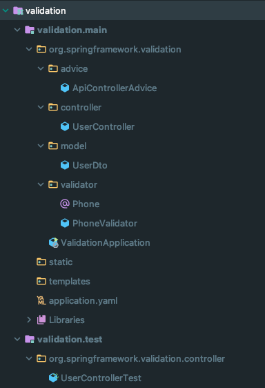

# @Valid

* spring boot 의 버전 업그레이드로 인해 web 의존성 안에 있던 constraints packages 가 모듈로 분리되었다.

```
implementation 'org.springframework.boot:spring-boot-starter-validation
```



- 프로젝트의 구조를 표현하였다.

``` java
@Slf4j
@RestController
public class UserController {

    private Logger logger = LoggerFactory.getLogger(UserController.class);

    @PostMapping("/v1/users")
    public ResponseEntity<String> savePost(final @Valid @RequestBody UserDto userDto) {
        logger.info("UserDto = '{}'", userDto.toString());
        return ResponseEntity.ok().body("postDto 객체 검증 성공");
    }
}
```

- @RequestBody 로 들어오는 객체에 @Valid 를 붙여주는 경우 해당 객체에 정의된 검증 값을 확인하게 된다.


``` java
@ToString
@Getter
@NoArgsConstructor(access = AccessLevel.PROTECTED)
public class UserDto {

    @NotNull
    private String name;

    @Phone
    private String phone;

    @Email
    private String email;

    @Builder
    public UserDto(String name, String phone, String email) {
        this.name = name;
        this.phone = phone;
        this.email = email;
    }
}

```

- @NotNull 을 통해서 필드 값의 null 유무를 검사한다.
- @Phone 을 통해서 필드 값이 핸드폰 번호 형식인지를 검사한다.
- @Email 을 통해서 필드 값이 이메일 형식인지를 검사한다.

# 사용자 정의 애노테이션

``` java
@Documented
@Constraint(validatedBy = PhoneValidator.class)
@Target({ElementType.METHOD, ElementType.FIELD})
@Retention(RetentionPolicy.RUNTIME)
public @interface Phone {
    String message() default "Invalid phone number";

    Class<?>[] groups() default {};

    Class<? extends Payload>[] payload() default {};
}

```

- 사용자 정의 valid annotation 을 생성할 수 있다.
- 해당 애노테이션의 타겟은 메서드, 필드로 제한한다.

``` java
public class PhoneValidator implements ConstraintValidator<Phone, String> {

    @Override
    public void initialize(Phone phone) {

    }

    @Override
    public boolean isValid(String value, ConstraintValidatorContext context) {
        return value != null && value.matches("^[0-9]{3}[-]+[0-9]{4}[-]+[0-9]{4}$");
    }
}

```

- ConstraintValidator 인터페이스를 상속받아서 사용자 정의 검증 클래스를 생성한다.
- matches() 메서드에 정규식 값을 파라미터로 주어 핸드폰 형식인지를 검사한다.

# MockMvc 를 이용한 테스트 코드

``` java
@WebMvcTest(UserController.class)
@AutoConfigureMockMvc
class UserControllerTest {

    @Autowired
    private MockMvc mockMvc;

    @Autowired
    private ObjectMapper objectMapper;

    @Test
    void savePostSuccess() throws Exception {

        UserDto userDto = UserDto.builder()
                .name("shlee")
                .phone("010-1234-5678")
                .email("ac2dia@gmail.com")
                .build();

        String userDtoJsonString = objectMapper.writeValueAsString(userDto);
        System.out.println(userDtoJsonString);

        mockMvc.perform(post("/v1/users")
                .contentType(MediaType.APPLICATION_JSON)
                .content(userDtoJsonString))
                .andExpect(status().is2xxSuccessful());

    }
}
```

- mockMvc 테스트 코드를 통해 dto 객체에 있는 필드 값들에 대해서 정의되어 있는 @Valid 통과 유무를 확인한다.

# 참고 문헌
[1] Java Bean Validation Basics, https://www.baeldung.com/javax-validation

[2] Validation in Spring Boot, https://www.baeldung.com/spring-boot-bean-validation

[3] Spring MVC Custom Validation, https://www.baeldung.com/spring-mvc-custom-validator
