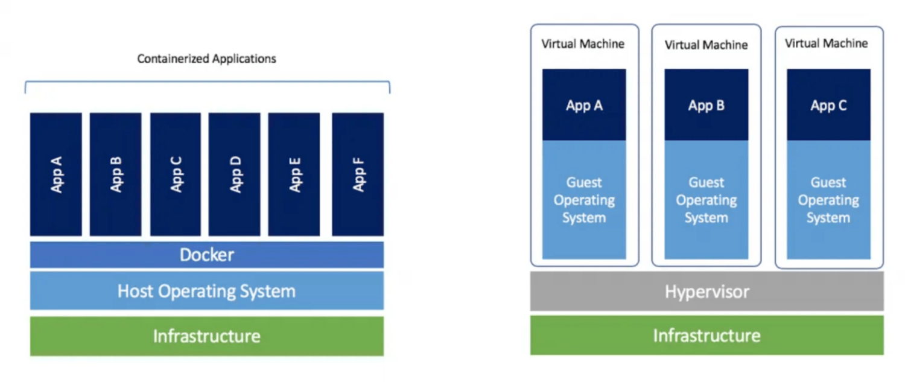

# 컨테이너란? 리눅스의 프로세스 격리 기능

## 리눅스 컨테이너란?

- 리눅스 컨테이너는 운영체제 수준의 가상화 기술로 리눅스 커널을 공유하면서 프로세스를 격리된 환경에서 실행하는 기술입니다.
- 하드웨어를 가상화하는 가상 머신과 달리 커널을 공유하는 방식이기 때문에 실행 속도가 빠르고, 성능 상의 손실이 거의 없습니다.
- 리눅스 네임스페이스Linux namespaces, 컨트롤 그룹cgroup, 루트 디렉터리 격리 등의 커널 기능을 활용해 격리되어 실행됩니다.

## 리눅스 컨테이너의 주요 특징

- 운영체제 수준의 가상화: 컨테이너는 운영체제 수준의 가상화 기술입니다. 별도의 하드웨어 에뮬레이션 없이 리눅스 커널을 공유해 컨테이너를 실행하며, 게스트OS 관리가 필요하지 않습니다.
- 빠른 속도와 효율성: 하드웨어 에뮬레이션이 없기 때문에 컨테이너는 아주 빠르게 실행됩니다. 프로세스 격리를 위해 아주 약간의 오버헤드가 있지만 일반적인 프로세스를 실행하는 것과 거의 차이가 없습니다. 또한 하나의 머신에서 프로세스만큼 많이 실행하는 것이 가능합니다.
- 높은 이식성 (portability): 모든 컨테이너는 호스트의 환경이 아닌 독자적인 실행 환경을 가지고 있습니다. 이 환경은 파일들로 구성되며, 이미지 형식으로 공유될 수 있습니다. 리눅스 커널을 사용하고 같은 컨테이너 런타임을 사용할 경우 컨테이너의 실행 환경을 공유하고 손쉽게 재현할 수 있습니다.
- 상태를 가지지 않음 (stateless): 컨테이너가 실행되는 환경은 독립적이기 때문에, 다른 컨테이너에게 영향을 주지 않습니다. 도커와 같이 이미지 기반으로 컨테이너를 실행하는 경우 특정 실행 환경을 쉽게 재사용할 수 있습니다.

## 컨테이너의 종류

- 시스템 컨테이너 (system container)
  - 시스템 컨테이너는 컨테이너 기술들을 사용해 운영체제 위에 하드웨어 가상화 없이 운영체제를 실행합니다. 일반적인 리눅스처럼 init 프로세스 등을 사용해서 다수의 프로세스가 같은 환경을 공유하는 것을 목표로 합니다. 시스템 컨테이너를 지향하는 컨테이너 런타임으로는 대표적으로 LXC와 LXD가 있습니다.
- 애플리케이션 컨테이너 (applcation container)
  - 애플리케이션 컨테이너는 컨테이너 기술을 활용해 하나의 애플리케이션(프로세스)를 실행하는 것을 목표로 합니다. 독립적인 환경을 가진다는 점에서는 시스템 컨테이너와 동일하지만, 단 하나의 프로세스만 실행한다는 점에서 확장이 쉽고 관리 요소가 거의 없습니다. 대표적인 애플리케이션 컨테이너 런타임으로는 도커Docker가 있습니다.

## 컨테이너를 사용해야하는 이유

- 왜 굳이 도커 (컨테이너)를 써야 하나요?
  - https://www.44bits.io/ko/post/why-should-i-use-docker-container#%EB%93%A4%EC%96%B4%EA%B0%80%EB%A9%B0-%EC%99%9C-%EB%8F%84%EC%BB%A4docker%EB%A5%BC-%EC%8D%A8%EC%95%BC%ED%95%98%EB%82%98%EC%9A%94

# Reference

[1] 컨테이너란? 리눅스의 프로세스 격리 기능, https://www.44bits.io/ko/keyword/linux-container#%EB%A6%AC%EB%88%85%EC%8A%A4-%EC%BB%A8%ED%85%8C%EC%9D%B4%EB%84%88%EB%9E%80
