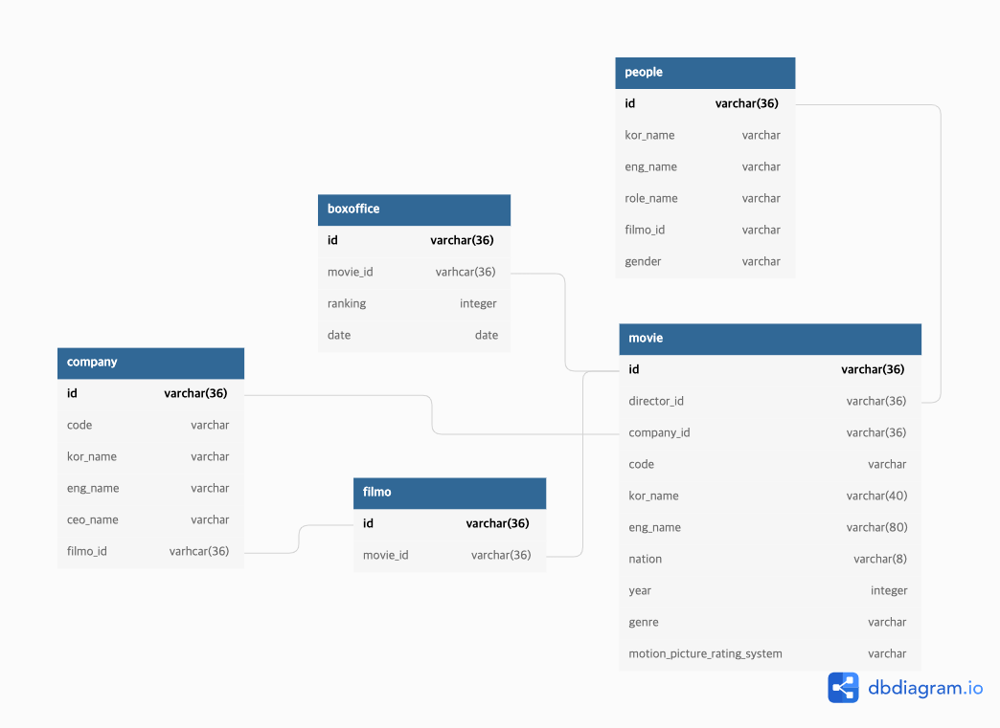

# movie 데이터베이스 설계



```sql
CREATE TABLE `boxoffice` (
  `id` varchar(36) PRIMARY KEY,
  `movie_id` varhcar(36),
  `ranking` integer,
  `date` date
);

CREATE TABLE `movie` (
  `id` varchar(36) PRIMARY KEY,
  `director_id` varchar(36),
  `company_id` varchar(36),
  `code` varchar(255),
  `kor_name` varchar(40),
  `eng_name` varchar(80),
  `nation` varchar(8),
  `year` integer,
  `genre` varchar(255),
  `motion_picture_rating_system` varchar(255)
);

CREATE TABLE `company` (
  `id` varchar(36) PRIMARY KEY,
  `code` varchar(255),
  `kor_name` varchar(255),
  `eng_name` varchar(255),
  `ceo_name` varchar(255),
  `filmo_id` varhcar(36)
);

CREATE TABLE `people` (
  `id` varchar(36) PRIMARY KEY,
  `kor_name` varchar(255),
  `eng_name` varchar(255),
  `role_name` varchar(255),
  `filmo_id` varchar(255),
  `gender` varchar(255)
);

CREATE TABLE `filmo` (
  `id` varchar(36) PRIMARY KEY,
  `movie_id` varchar(36)
);

ALTER TABLE `boxoffice` ADD FOREIGN KEY (`movie_id`) REFERENCES `movie` (`id`);

ALTER TABLE `movie` ADD FOREIGN KEY (`director_id`) REFERENCES `people` (`id`);

ALTER TABLE `movie` ADD FOREIGN KEY (`company_id`) REFERENCES `company` (`id`);

ALTER TABLE `company` ADD FOREIGN KEY (`filmo_id`) REFERENCES `filmo` (`id`);

ALTER TABLE `filmo` ADD FOREIGN KEY (`movie_id`) REFERENCES `movie` (`id`);
```

# 설계 의도

- 기존의 테이블 포맷을 따라가기 보다는 최대한 테이블을 분리하여 설계하였습니다.
- 각 테이블들간의 연관 관계를 설정하여 연관 관계 맵핑을 통해 데이터를 가져올 수 있도록 하였습니다.

# Reference

[1] kofic OPEN API, http://www.kobis.or.kr/kobisopenapi/homepg/apiservice/searchServiceInfo.do
