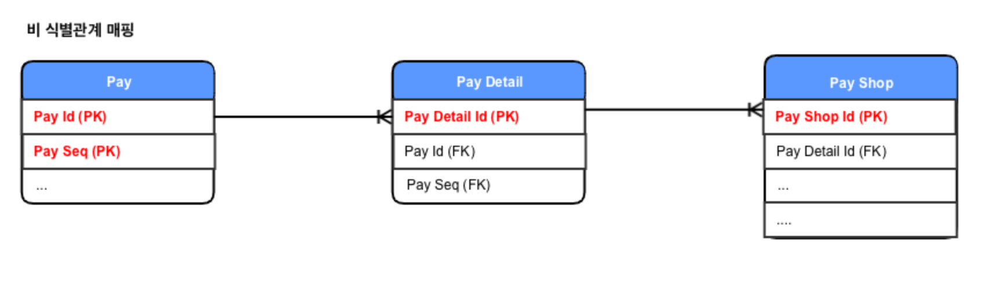

# JPA Entity Mapping (복합키 매핑 편)

- 대부분 테이블에서는 하나의 컬럼으로만 PK 를 설정하고 있습니다.
- 하지만 테이블에서 두 개 이상의 컬럼을 이용하여 복합키를 설정하는 경우 JPA 에서는 두 가지 방법으로 처리할 수 있습니다.
  - 1. @Embeddable
  - 2. @IdClass

## 레거시 RDB 의 테이블 PK 생성 전략


- 부모 테이블의 기본키를 자식 테이블로 전파하는 방식
- 자식 테이블의 기본키 컬럼이 점점 늘어나며, JOIN 할때 SQL이 복잡해지고 기본키 인덱스가 불필요하게 커질 수 있다.
- 기본키 인덱스를 활용하기 좋고, 특정 상황에 조인 없이 하위 테이블만으로 검색을 완료할 수 있다.



- 비식별 관계에서 기본키는 대부분 대리키를 사용합니다.
- 대리키의 경우 @GenerateValue 또는 UUID 방식을 사용하면 편하게 관리할 수 있습니다.

## 1. @Embeddable

```java

@Getter
@Entity
@NoArgsConstructor
public class PayShop {

    @EmbeddedId
    private PayShopId id;

    private String shopName;

    @MapsId(value = "payId")
    @ManyToOne(fetch = FetchType.LAZY)
    private Pay pay;

    public PayShop(PayShopId id,
                   String shopName) {
        this.id = id;
        this.shopName = shopName;
    }

    public void setPay(Pay pay) {
        if (pay != null) {
            pay.getPayShops().remove(this);
        }
        this.pay = pay;
        this.pay.getPayShops().add(this);
    }
}

@Getter
@EqualsAndHashCode(onlyExplicitlyIncluded = true)
@Embeddable
@NoArgsConstructor
public class PayShopId implements Serializable {

    /**
     * 테이블에서 정의하는 컬럼 사이즈
     */
    public static final int SHOP_NUMBER_SIZE = 12;

    @EqualsAndHashCode.Include
    private PayDetailId payDetailId;

    @EqualsAndHashCode.Include
    @Column
    private String shopNumber;

    public PayShopId(PayDetailId payDetailId,
                     String shopNumber) {
        Preconditions.checkArgument(shopNumber.length() <= SHOP_NUMBER_SIZE);

        this.payDetailId = payDetailId;
        this.shopNumber = shopNumber;
    }
}

@EqualsAndHashCode(onlyExplicitlyIncluded = true)
@Embeddable
@NoArgsConstructor
public class PayDetailId implements Serializable {

    @EqualsAndHashCode.Include
    private PayId payId;

    @EqualsAndHashCode.Include
    @Column
    private Long payDetailId;

    public PayDetailId(PayId payId,
                       Long payDetailId) {
        this.payId = payId;
        this.payDetailId = payDetailId;
    }
}

@Getter
@EqualsAndHashCode(onlyExplicitlyIncluded = true)
@Embeddable
@NoArgsConstructor
public class PayId implements Serializable {

    /**
     * 결제번호 (비즈니스적으로 유의미한 번호)
     */
    @EqualsAndHashCode.Include
    @Column
    private Long payNumber;

    @EqualsAndHashCode.Include
    @Column
    private Long paySeq;

    public PayId(Long payNumber,
                 Long paySeq) {
        this.payNumber = payNumber;
        this.paySeq = paySeq;
    }
}
```

- 코드는 객체지향스럽게 짜졌으나 비즈니스적으로 유의미한 값인 PayNumber를 사용하기 위해서는 객체 그래프 탐색을 깊게 해야하며, IdClass 속에 깊이 감춰져 있어서 명시적으로 보이지 않는 단점이 있습니다.
- 코드로 payShop 객체에서 PayNumber 를 가져오기 위해서는 아래와 같은 그래프 탐색을 해야합니다.

```java
payShop.getId().getPayDetailId().getPayId().getPayNumber();
```

## 2. @IdClass

```java
@Getter
@Entity
@Table(name = "pay_shop")
@IdClass(PayShopId.class)
@NoArgsConstructor
public class PayShop {

    @Id
    private Long payNumber;

    @Id
    private Long paySeq;

    @Id
    private Long payDetailId;

    @Id
    private String shopNumber;

    private String shopName;

    @ManyToOne(fetch = FetchType.LAZY, optional = true)
    @JoinColumns(value = {
            @JoinColumn(name = "payNumber", updatable = false, insertable = false),
            @JoinColumn(name = "paySeq", updatable = false, insertable = false),
            @JoinColumn(name = "payDetailId", updatable = false, insertable = false)
    }, foreignKey = @ForeignKey(value = ConstraintMode.NO_CONSTRAINT))
    private PayDetail payDetail;

    public PayShop(Long payNumber,
                    Long paySeq,
                    Long payDetailId,
                    String shopNumber,
                    String shopName) {
        this.payNumber = payNumber;
        this.paySeq = paySeq;
        this.payDetailId = payDetailId;
        this.shopNumber = shopNumber;
        this.shopName = shopName;
    }

    /**
     * 연관관계 매핑 메소드
     */
    public void setPayDetail(PayDetail payDetail) {
        if (payDetail != null) {
            payDetail.getPayShops().remove(this);
        }
        this.payDetail = payDetail;
        this.payDetail.getPayShops().add(this);
    }
}

@EqualsAndHashCode(onlyExplicitlyIncluded = true)
@NoArgsConstructor
public class PayShopId implements Serializable {

    @EqualsAndHashCode.Include
    @Id
    private Long payNumber;

    @EqualsAndHashCode.Include
    @Id
    private Long paySeq;

    @EqualsAndHashCode.Include
    @Id
    private Long payDetailId;

    @EqualsAndHashCode.Include
    @Id
    private String shopNumber;
}
```

## 비교

|      | @EmbededId                                                                          | @IdClass                                                                                            |
| ---- | ----------------------------------------------------------------------------------- | --------------------------------------------------------------------------------------------------- | ---------------------------------------------------------------------------------------------------------------------------------------------------------- |
| 장점 | – 객체지향적이다. (예제의 shopNumber 컬럼체크)<br> – @MapsId를 이용한 객체생성 편리 |                                                                                                     | – 비즈니스적으로 의미있는 PK 값이라면 명시적으로 필드를 노출할 수 있다. <br>– 식별관계 매핑을 여러 테이블에서 사용할때, 객체 연관관계를 단순하게 유지 가능 |
| 단점 | – 복합키구조가 2개이상 테이블에 식별관계로 매핑이 될때 복잡도가 증가한다.           | – 컬럼에 대한 필드선언이 중복이 발생한다.<br> – @MapsId 활용이 불가능하여 객체 생성할때 주의를 요함 |

- @EmbeddedId 방식의 경우 단순히 하나의 복합키만 존재하는 경우 권장하는 방식이지만, 복합키를 통한 식별관계 매핑이 여러개 존재하는 경우 @IdClass 사용을 권장합니다.

## 핵심

- 복합키를 사용하는 것도 좋지만 비식별관계를 사용하고, 기본 키는 Long 타입 혹은 UUID를 이용하여 대리키를 사용해보자!!
- 현재 만들어둔 방식은 식별관계 매핑인데 ... 요것도 다시 리팩토링해서 비식별관계 매핑으로 변경하자!

# Reference

[1] Legacy DB의 JPA Entity Mapping (복합키 매핑 편), https://techblog.woowahan.com/2595/
