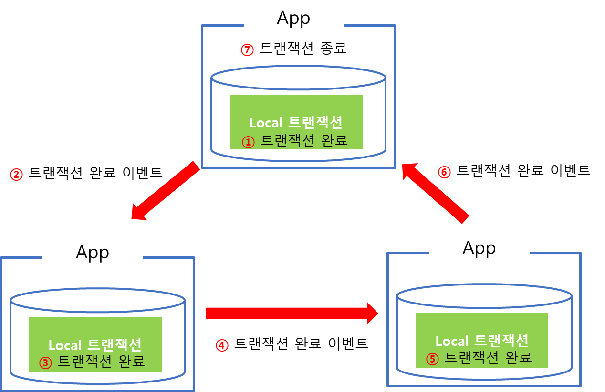
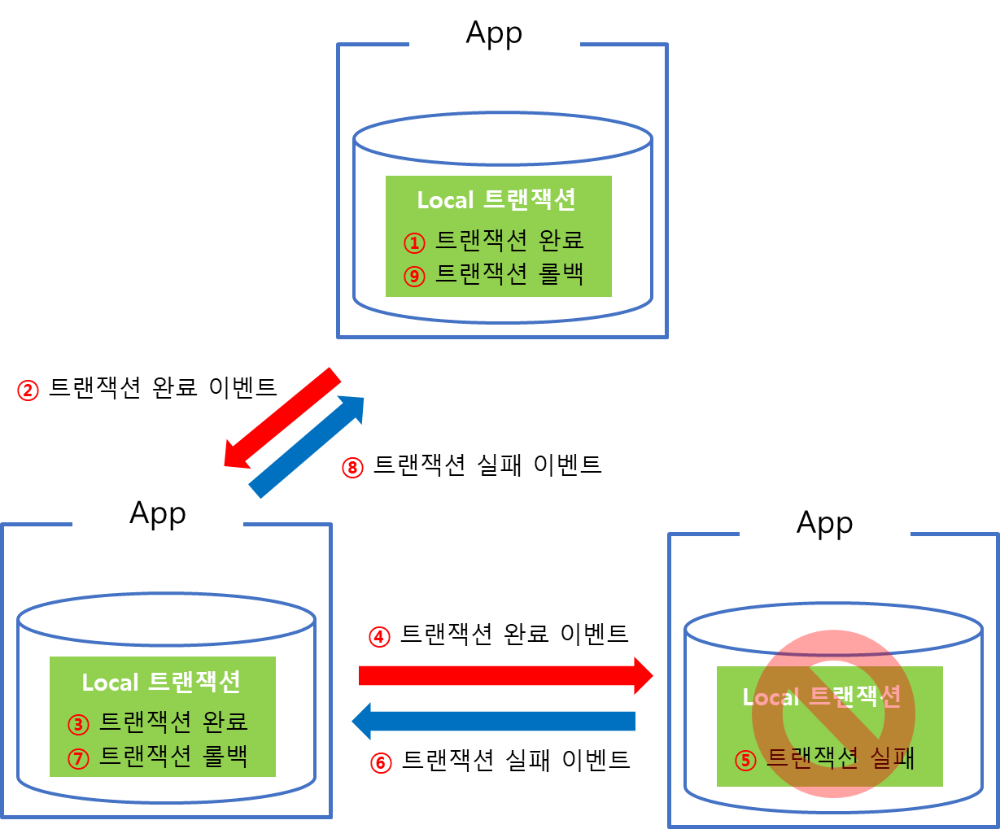

# saga pattern

## SAGA Pattern 등장

- MSA 아키텍처를 구성하기 어려운 이유 중 하나! 트랜잭션 처리
- Application, DB 가 분산되면서 해당 트랜잭션에 대한 롤백을 어떻게 할 것인지?

## SAGA Pattern 이란

- Micro Service 들이 이벤트를 주고 받는 중 작업이 실패하면 이전깢의 작업이 완료된 트랜잭션에 대한 보상이 필요합니다. 이러한 보상 이벤트를 통해 원자성을 보장하는 패턴을 말합니다.

- 트랜잭션의 관리주체는 DBMS 에 있는 것이 아니라 Application 에 있습니다.
- 또한 각 Application 은 하위에 존재하는 DB의 트랜잭션만 담당하며, 각각의 Application 의 트랜잭션 요청 실패로 인한 롤백 처리는 Application 에서 구현합니다.

## SAGA Pattern 의 종류

- Choreography based SAGA

  - 보유한 서비스 내의 트랜잭션을 관리하며, 트랜잭션 종료시 완료 이벤트를 발행합니다.
  - 다음 수행할 트랜잭션이 있으면 해당 트랜잭션을 수행해야하는 Application 으로 이벤트를 전달하고, 처리하고를 반복합니다.
  - 각 Application 뱔로 트랜잭션을 관리하는 로직이 있어 트랜잭션 실패시 Application 에서 보상 이벤트를 발행하여 롤백을 처리합니다.

- Orchestration based SAGA
  - 트랜잭션 처리를 담당하는 SAGA Instance(Manager) 가 별도로 존재합니다.
  - 트랜잭션에 관여하는 모든 Application 은 Manager 에 의해 점진적으로 트랜잭션을 수행하며, 결과를 Manager 에게 전달하고를 반복하며 트랜잭션 실패시 Manager 를 통해 보상 트랜잭션이 실행됩니다.

## 생각? 어떤게 더 좋을까?

- 현재 사내에서 실행하는 서비스의 경우 3개 이상의 다른 서비스에서 트랜잭션을 관리하는 경우는 없고, 2개까지만 존재하는 간단한 형태이기에 Choreography based SAGA 방식이 구현하기에 더 적합한것 같습니다.

# Reference

[1] [Architecture] MSA : SAGA 패턴이란, https://azderica.github.io/01-architecture-msa/
