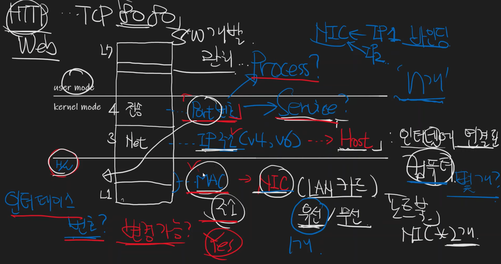

# MAC주소, IP주소, Port번호가 식별하는 것

## OSI 7 Layer 구분
- user mode (L7, L6, L5)
- kernel mode (L4, L3)
- H/W (L2, L1)

## 레이어별 식별자
- L4 = Port 번호
  - process? service?
  - 
- L3 = IP 주소 (v4, v6) => Host 식별자
  - NIC 하나당 여러개의 IP binding 가능, n개
- L2 = Mac 주소 => NIC 식별자
  - LAN 카드 (유선/무선), 2개
  - MAC 주소 변경 가능? Yes

# Reference
[1] MAC주소, IP주소, Port번호가 식별하는 것, https://youtu.be/JDh_lzHO_CA
