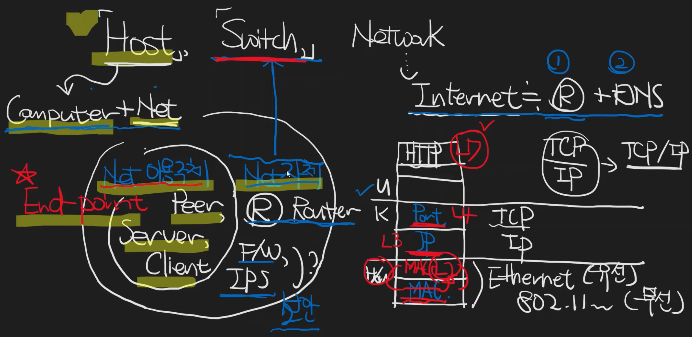

# Host, Switch, Network 이들의 관계에 대해

## Host
- Computer + Network
- 네트워크에 연결된 컴퓨터

- 네트워크 이용주체 (End-point)
  - peer, server, client

## Switch
- Network 자체
  - router
  - F/W
  - IPS

## Network
- Internet
  - router + DNS

# Reference
[1] Host, Switch, Network 이들의 관계에 대해..., https://youtu.be/kGst-VftN1w