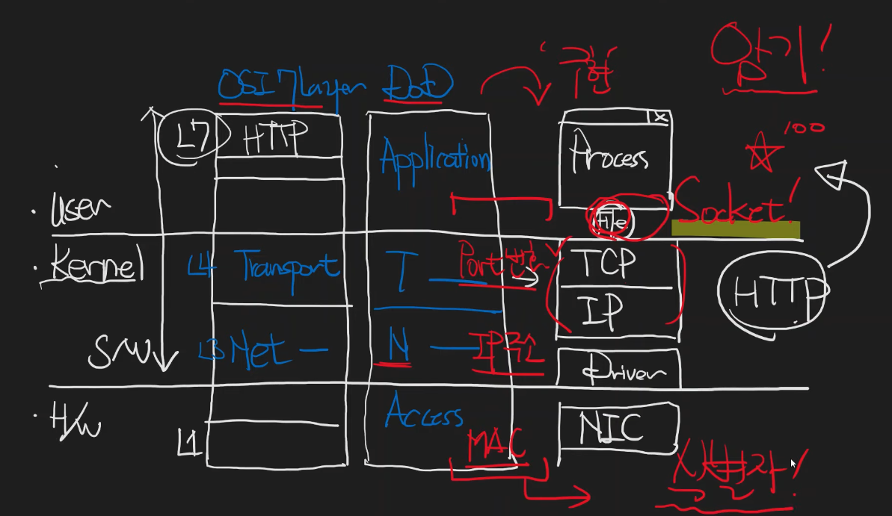

# 네트워크를 배우려는 사람들을 위해

3가지 영역 (OSI 7 Layer) [DoD]
- User (L5, L6, L7) [Application] -> Process, File, Socket
- Kernel (L3, L4) [Transport, Network] -> TCP/IP, Driver
- H/W (L1, L2) [Access] -> NIC

Transport (Port)
Network (IP)
NIC (Mac)

# Reference
[1] 네트워크를 배우려는 사람들을 위해, https://youtu.be/k1gyh9BlOT8