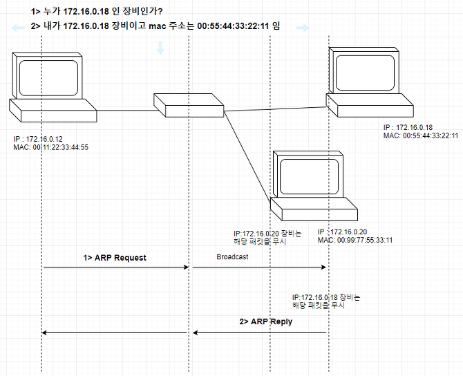

# ARP 패킷의 원리와 이해

## ARP (Address Resolution Protocol)
- 논리적 주소(IP Address)를 기반으로 물리적 주소(MAC Address)를 알아오는 프로토콜
- ARP는 Layer 2계층 이더넷 환경에서 목적지 IP주소에 대한 MAC주소 변환 동작을 담당함.
- 쉽게 말해 해당 패킷은 목적지 IP 주소를 통해 해당 장비의 MAC Address 를 알 수 있게 해줌

## ARP 패킷이 필요한 이유?
- L2 스위치는 이더넷 프레임(MAC 기반) 을, L3 스위치는 패킷(IP 주소 기반) 를 기준으로 동작함.
- 따라서, 결론을 먼저 이야기 하면 inter networking 환경에서 MAC 주소와 IP 주소를 알아야 스위치, 라우터 조합의 네트워크 망에서 통신이 가능함.
- 간단하게 생각해보면 TCP/IP 스택을 생각하면 이해가 빠름 

## ARP 테이블이란?
- 네트워크에 있는 장비들에게서 항상 이러한 ARP 프로세스 과정이 발생한다면 그 망에 traffic 이 심하여 부담이 됨. 따라서, ARP table 이라는 것이 존재하고 미리 IP/MAC addr 주소를 적어 놓는 과정을 진행한다. ARP table 에 없는 ARP 정보는 ARP table 을 갱신하여 저장해 놓는다. 
- 일정 주기마다 테이블 갱신 (default: 300s)
- 캐시 형태로 사용

## ARP 동작원리
- ARP request : 송신자는 목적지와 통신을 할 의도가 있다면 목적지의 물리적인 주소가 필요하므로,       물리주소 요청을 위한 ARP 요청 패킷을 브로드캐스트로 전송(목적지의 물리 주소를 모르므)
- ARP reply : 모든 호스트와 라우터는 송신자가 보낸 ARP 요청 패킷을 수신하여 해당되는 수신자 (송신자가 요청한 IP를 확인하여)는자신의 IP와 MAC 을 넣어 응답패킷을 보냄.
- ARP Gratuitous ARP : IP 주소 충돌감지를 위해 사용하는 packet. 나와 동일 subnet 상에 존재하는 호스트/라우터가 누군가 GARP 를 보내면 자신의 ARP table 을 갱신함

출처: https://sjlim5092.tistory.com/22 [My Own Style]

# Reference
[1] arp 패킷의 원리와 이해, https://sjlim5092.tistory.com/22