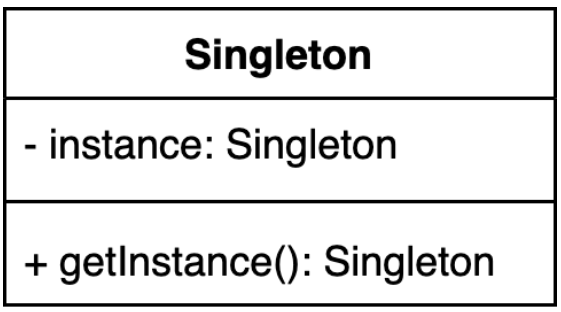

# 싱글톤 (Singleton) 패턴
- 인스턴스를 오직 한개만 제공하는 클래스
  - 시스템 런타임, 환경 셋팅에 대한 정보 등, 인스턴스가 여러개 일 때 문제가 생길 수 있는 경우가 있기에 인스턴스를 오직 한 개만 만들어 제공하는 클래스가 필요하다.

# 싱글톤 (Singleton) 패턴 구현 방법
## 싱글톤 (Singleton) 패턴 구현 방법 1
### private 생성자에 static 메소드
- 1. 생성자를 private으로 만든 이유?
  - 인스턴스를 오직 한 개만 제공해야 하기 때문에 생성자를 통한 인스턴스 생성을 방지해야 한다.

- 2. getInstance() 메소드를 static으로 선언한 이유?
  - 싱글톤 클래스의 경우 인스턴스는 오직 한 개만 생성이 되어야 하기에 모두가 공유할 수 있어야 한다.

- 3. getInstance()가 멀티쓰레드 환경에서 안전하지 않은 이유?
  - 멀티 쓰레드 환경에서 instance 가 초기화되어 있지 않은 상태에서 동시에 getInstance() 를 호출하는 경우 여러 인스턴스가 생성될 수 있다.

## 싱글톤 (Singleton) 패턴 구현 방법 2
### 동기화(synchronized)를 사용해 멀티쓰레드 환경에 안전하게 만드는 방법
- 1. 자바의 동기화 블럭 처리 방법은?
  - synchronized 키워드를 사용하여 lock 을 걸어 쓰레드 동시 접근을 방지한다.

- 2. getInstance() 메소드 동기화시 사용하는 락(lock)은 인스턴스의 락인가 클래스의 락인가? 그 이유는?
  - static 메서드의 경우 클래스 레벨의 락입니다.
  - https://howtodoinjava.com/java/multi-threading/object-vs-class-level-locking/

## 싱글톤 (Singleton) 패턴 구현 방법 3
### 이른 초기화 (eager initialization)을 사용하는 방법
- 1.이른 초기화가 단점이 될 수도 있는 이유?
  - 클래스를 메모리에 미리 할당하기 때문에 사용하지 않는 경우, 메모리 측면에서 손해입니다.

- 2. 만약에 생성자에서 checked 예외를 던진다면 이 코드를 어떻게 변경해야 할까요?
  - try-catch를 사용하여 unchecked 예외로 변환시켜야 한다.

## 싱글톤 (Singleton) 패턴 구현 방법 4
### double checked locking으로 효율적인 동기화 블럭 만들기
- 1. double check locking이라고 부르는 이유?
  - 객체 초기화 여부 검사를 두 번 하기 때문입니다.

- 2. instacne 변수는 어떻게 정의해야 하는가? 그 이유는?
  - 변수에 volatile 키워드를 붙여야 합니다. 
  - 키워드를 사용하지 않는 변수는 성능향상을 위해 CPU 캐시에 저장되는데, 이 경우 쓰레드가 변수 값을 읽어올 때 각각의 CPU 캐시에서 가져오기 때문에 값의 불일치가 발생합니다.

## 싱글톤 (Singleton) 패턴 구현 방법 5 
### static inner 클래스를 사용하는 방법
- 1. 이 방법은 static final를 썼는데도 왜 지연 초기화 (lazy initialization)라고 볼 수 있는가?
  - INSTANCE 변수의 경우 static final 로 선언되어 있지만, 해당 변수가 선언된 클래스는 getInstance() 메서드가 호출될 때 로딩되기 때문에 지연 초기화로 볼 수 있습니다.

## 싱글톤 (Singleton) 패턴 구현 방법 6 
### enum을 사용하는 방법
- 1. enum 타입의 인스턴스를 리플랙션을 통해 만들 수 있는가?
  - 없습니다.

- 2. enum으로 싱글톤 타입을 구현할 때의 단점은?
  - early initialize 를 함으로써 메모리 손실이 발생합니다.

- 3. 직렬화 & 역직렬화 시에 별도로 구현해야 하는 메소드가 있는가?
  - enum 은 기본적으로 Enum 클래스를 상속받으며, 해당 클래스에는 Serialize 가 있기 때문에 별도의 작업 없이 직렬화 & 역직렬화가 가능합니다.

# 싱글톤 (Singleton) 패턴 구현 깨뜨리는 방법
## 싱글톤 (Singleton) 패턴 구현 깨트리는 방법 1 
### 리플렉션을 사용한다면?
- 1. 리플렉션에 대해 설명하세요.
  - 구체적인 클래스의 타입을 알지 못해도 내부의 메서드, 필드들에 접근할 수 있게 해주는 자바 API

- 2. setAccessible(true)를 사용하는 이유는?
 - 해당 예제에서는 기본 생성자를 private 선언하였기 때문에 외부 호출이 불가능합니다. 그렇기에 기본 생성자를 사용 가능하게 해줌으로써 newInstance() 를 사용하여 새로운 객체를 만들 수 있게 해줍니다.

## 싱글톤 (Singleton) 패턴 구현 깨트리는 방법 2 
### 직렬화 & 역직렬화를 사용한다면?
- 1. 자바의 직렬화 & 역직렬화에 대해 설명하세요. 
  - 직렬화는 자바 시스템 내부에서 사용하는 객체 또는 데이터를 외부의 자바 시스템에서도 사용 가능하도록 byte 형태로 데이터를 변환하는 기술입니다.
  - 역직렬화는 byte 로 변환된 데이터를 원래의 객체 또는 데이터로 변환하는 기술입니다.

- 2. SerializableId란 무엇이며 왜 쓰는가?
  - Serializable 인터페이스를 상속받는 경우 클래스의 버전 관리를 위해 serialVersionUID 를 사용합니다. 이 경우 명시적으로 선언해주지 않으면 컴파일러가 계산한 값을 부여하는데 클래스에 변경 사항이 있는 경우 UID 값이 바뀌게 됩니다.
  - Serialize, Deserialize 할 때의 UID 값이 다른 경우 InvalidClassExceptions 가 발생하여 저장된 값을 객체로 복원할 수 없습니다. 

- 3. try-resource 블럭에 대해 설명하세요.
  - try with resource 라는 기법으로 자원을 사용해 종료를 꼭 해주어야하는 리소스들을 대상으로 명시적으로 종료를 해주지 않아도 자동으로 종료해줍니다.

# 싱글톤 정리
## 싱글톤 (Singleton) 패턴 복습 
- 자바에서 enum을 사용하지 않고 싱글톤 패턴을 구현하는 방법은? 
- private 생성자와 static 메소드를 사용하는 방법의 단점은?  
- enum을 사용해 싱글톤 패턴을 구현하는 방법의 장점과 단점은? 
- static inner 클래스를 사용해 싱글톤 패턴을 구현하라.

## 싱글톤 (Singleton) 패턴 
### 실무에서는 어떻게 쓰이나?
- 스프링에서 빈의 스코프 중에 하나로 싱글톤 스코프.
- 자바 java.lang.Runtime
- 다른 디자인 패턴(빌더, 퍼사드, 추상 팩토리 등) 구현체의 일부로 쓰이기도 한다.

# Reference
[1] 코딩으로 학습하는 GoF의 디자인 패턴
, https://www.inflearn.com/course/%EB%94%94%EC%9E%90%EC%9D%B8-%ED%8C%A8%ED%84%B4/dashboard
[2] Object level lock vs Class level lock in Java, https://howtodoinjava.com/java/multi-threading/object-vs-class-level-locking/