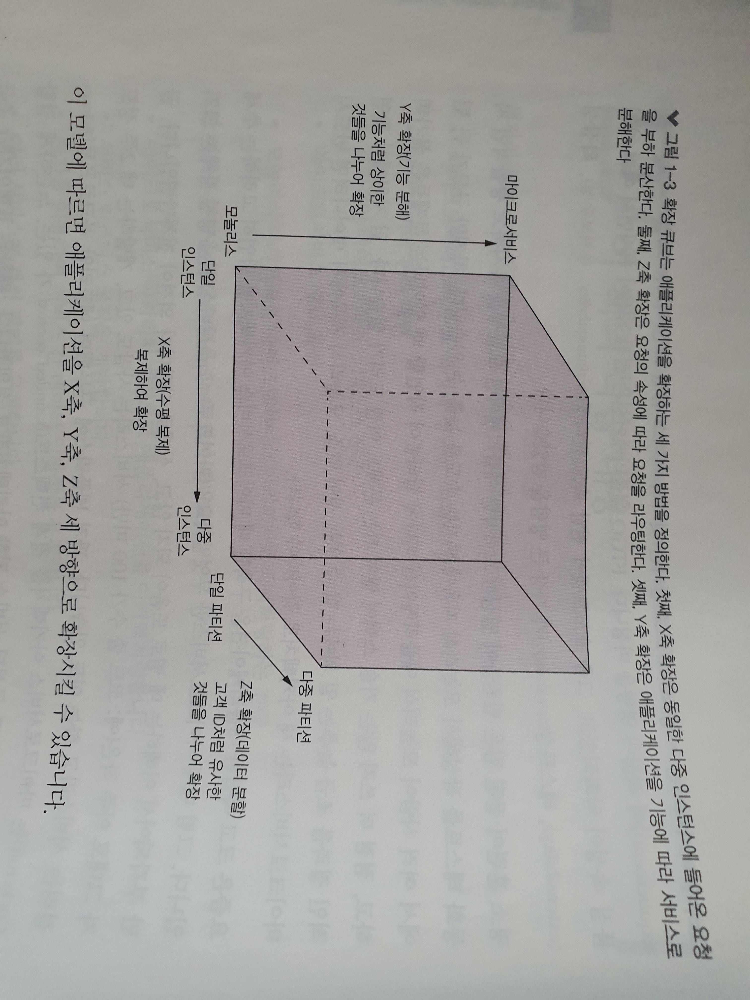
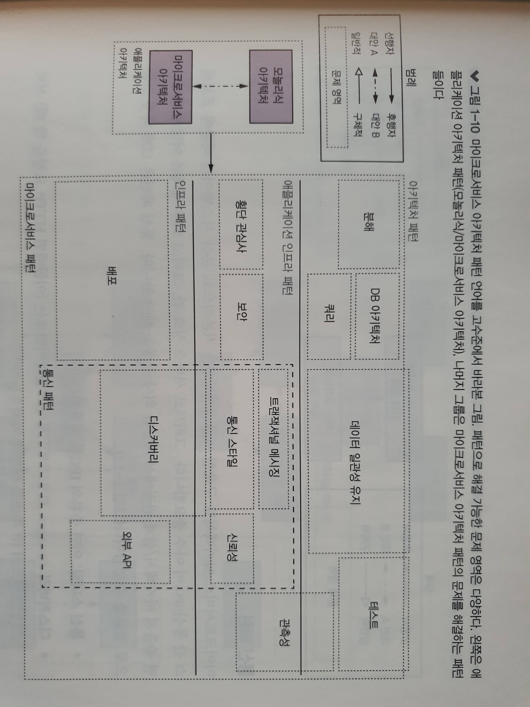

# 1장. 모놀리식 지옥에서 벗어나라

## MSA 특징

### 확장 큐브

* 애플리케이션을 x, y, z축 세 방향으로 확장할 수 있다.
  * x축 확장: 다중 인스턴스에 고루 요청 분산 (로드밸런싱)
  * y축 확장: 요청 속성별 라우팅
  * z축 확장: 기능에 따라 애플리케이션을 서비스로 분해

### 모듈성

* MSA 아키텍처에서는 서비스를 모듈성의 단위로 사용합니다.

### DB

* MSA 아키텍처에서는 서비스마다 각각 자체 DB를 가지고 있습니다.

### MSA vs SOA

* 독립적인 소규모 서비스 vs 대규모 모놀리식 애플리케이션

### MSA 아키텍처의 장단점

* 장점
    * 지속적 전달/배포
    * 서비스 규모가 작아 관리 용이
    * 독립적으로 배포/확장
* 단점
    * 적합한 서비스를 찾기 어려움
    * 분산 시스템이 너무 복잡함
    * 서비스 배포시 조율할 점이 많음
    * MSA 아키텍처 도입 시기를 결정하기 어려움

### 디자인 패턴

* GoF 디자인 패턴

### MSA 아키텍처 패턴

* 인프라 패턴: 주로 개발 영역 밖의 인프라 문제를 해결합니다.
* 애플리케이션 인프라: 개발에도 영향을 미치는 인프라 문제를 해결합니다.
* 애플리케이션 패턴: 개발자가 맞딱드리는 문제를 해결합니다.