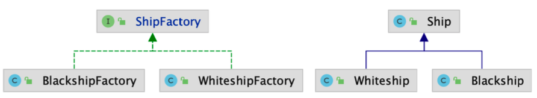

# 팩토리 메소드 (Factory Method) 패턴

- 구체적으로 어떤 인스턴스가 만들지는 서브 클래스가 정한다.
- 다양한 구현체가 있고, 그 중에서 특정한 구현체를 만들 수 있는 다양한 팩토리를 제공할 수 있다.

# 팩토리 메소드 (Factory Method) 패턴 구현 방법

## 확장에 열려있고 변경에 닫혀있는 구조로 만들어보자 (SOLID 원칙에서의 OCP)

# 팩토리 메소드 (Factory Method) 패턴 복습

## 구체적으로 어떤 것을 만들지는 서브 클래스가 정한다.

- 팩토리 메소드 패턴을 적용했을 때의 장점은? 단점은?

  - ㅇㅇ

- "확장에 열려있고 변경에 닫혀있는 객체 지향 원칙"을 설명하세요.

  - OCP

- 자바 8에 추가된 default 메소드에 대해 설명하세요.

  - ㅇㅇ

# 팩토리 메소드 (Factory Method) 패턴

## 실무에서는 어떻게 쓰이나?

- 단순한 팩토리 패턴
  - 매개변수의 값에 따라 또는 메소드에 따라 각기 다른 인스턴스를 리턴하는 단순한 버전 의 팩토리 패턴
  - java.lang.Calendar 또는 java.lang.NumberFormat
- 스프링 BeanFactory
  - Object 타입의 Product를 만드는 BeanFacotry라는 Creator!
